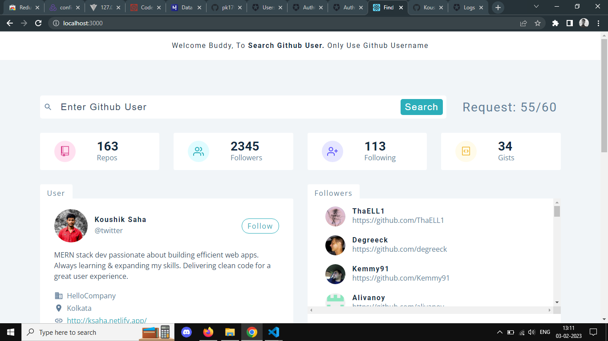
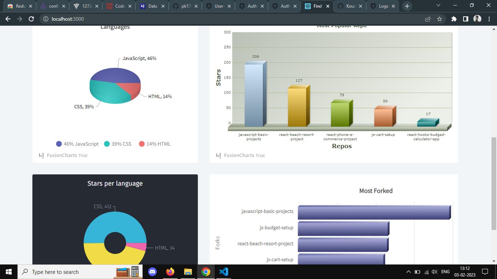

# **Silico Note App**

### My Internship Project

**It is a Note taking App with Authentication System. MERN technology used here.**

## Author

- [@Koushik Saha](https://www.github.com/koushikwebdev)

## Live

### **[Find Github User](https://finddev.netlify.app)**

## Tech Stack

**Client:** React, StyledComponent,ContextApi

## Features

- Find Github user by user name of Github
- You Can see no. of repos, followers, most used language etc.

## App Screenshots




## Deployment

To deploy backend and frontend project run

```bash
  npm start
```
